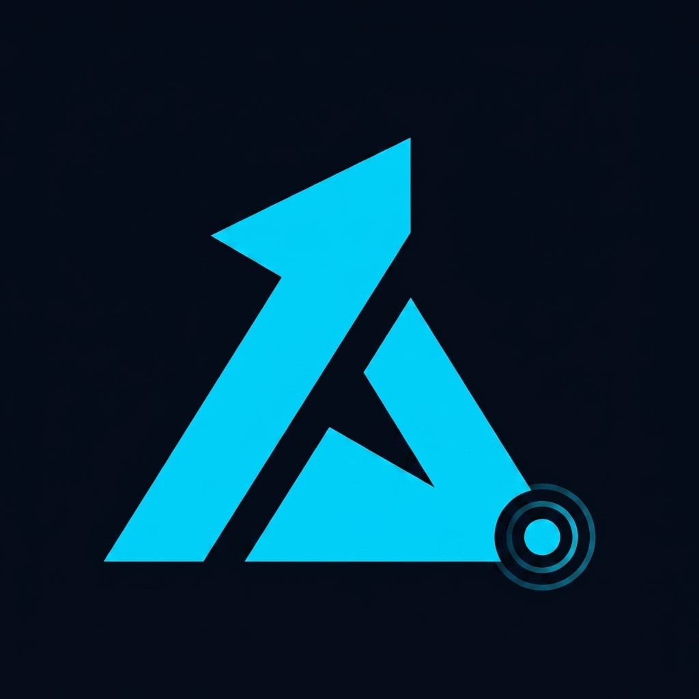

<p align="center">
  
</p>

<h1 align="center">AtrisTracker</h1>

<p align="center">
  <b>Professional Frameless Desktop Overlay for Tracking AI CLI Tool Usage & Rolling Reset Limits</b>
</p>

<p align="center">
  <a href="README.tr.md"><b>🇹🇷 Türkçe README</b></a> •
  <a href="#key-features">Key Features</a> •
  <a href="#tech-stack">Tech Stack</a> •
  <a href="#getting-started">Getting Started</a> •
  <a href="#architecture">Architecture</a>
</p>

<p align="center">
  
  
  
  
  
  
</p>

---

## 📌 Overview

**AtrisTracker** is a sleek, ultra-fast frameless desktop overlay application engineered for developers using modern AI CLI tools like **Antigravity CLI**, **Codex CLI**, and **Claude Code**.

It provides real-time visibility into rolling 5-hour percentage windows, request counts, weekly reset schedules, and single-login active account snapshots—all stored locally in a lightweight SQLite database and presented in a dark glassmorphic floating window that stays on top of your workspace.

---

## ✨ Key Features

- **🛸 Frameless Floating Overlay Window**:
  - Always-on-Top toggle (`Pin` mode) to keep metrics visible during active coding.
  - Custom draggable titlebar (`-webkit-app-region: drag`).
  - System Tray integration (Minimize to tray, Show/Hide, Instant Scan, Exit).

- **📊 Comprehensive CLI Coverage**:
  - **Antigravity CLI**: Automatically detects logged-in account, single-login session states, and 5-hour rolling usage.
  - **Codex CLI**: Tracks request quotas, rolling 5h reset countdowns, and weekly token stats.
  - **Claude Code**: Monitors usage percentages and weekly reset timelines.
  - **Overview Tab**: Displays side-by-side comparison cards for all 3 tools in a single view.

- **⏱️ Real-Time Countdown & Visual Meters**:
  - SVG Radial progress meters with dynamic color transitions (Emerald -> Amber -> Rose).
  - Ticking digital countdown timer (`hh:mm:ss`) to the exact 5-hour rolling window reset time.
  - Weekly reset timeline and total request counts.

- **💾 Durable Local Storage (SQLite)**:
  - Local database powered by `sql.js` stored at `%APPDATA%\ai-usage-tracker\ai_usage_tracker.db`.
  - Historical snapshot logging for trend visualization via Recharts.

---

## 🛠️ Tech Stack

| Layer | Technology | Description |
| :--- | :--- | :--- |
| **Desktop Shell** | [Electron 34](https://www.electronjs.org/) | Frameless window, system tray, IPC bridge |
| **Frontend Framework** | [React 18](https://react.dev/) + [Vite 6](https://vitejs.dev/) | Modern reactive component architecture & fast HMR |
| **Styling** | [Tailwind CSS 3](https://tailwindcss.com/) | Custom dark glassmorphism design system |
| **Database** | [SQLite (`sql.js`)](https://sql.js.org/) | In-memory WASM SQLite engine persisted to local file |
| **Charts & Icons** | [Recharts](https://recharts.org/) & [Lucide Icons](https://lucide.dev/) | Usage trends visualization and UI icons |

---

## 🚀 Getting Started

### Prerequisites

- **Node.js**: v18.x or later (v24+ supported)
- **npm**: v9.x or later

### Installation

1. **Clone the repository**:
   ```bash
   git clone https://github.com/username/atristracker.git
   cd atristracker
   ```

2. **Install dependencies**:
   ```bash
   npm install
   ```

3. **Extract Electron binaries** (if required on Windows):
   ```bash
   node scripts/setupElectron.js
   ```

---

## 💻 Running the Application

### Development Mode (Vite HMR + Electron)
```bash
npm run electron:dev
```

### Production Build & Launch
```bash
# 1. Build Vite assets
npm run build

# 2. Launch Electron
npm run electron:start
```

---

## 📐 Project Structure

```
AtrisTracker/
├── assets/
│   └── logo.jpg               # Generated high-res AtrisTracker logo
├── electron/
│   ├── main.js                # Main process, overlay window & tray setup
│   ├── preload.js             # IPC security context bridge
│   ├── db.js                  # SQLite database wrapper (sql.js)
│   └── cliScanner.js          # CLI usage & account scanner
├── src/
│   ├── components/
│   │   ├── Header.jsx         # Custom drag bar & overlay actions
│   │   ├── NavigationTabs.jsx # Tool tabs & view switcher
│   │   ├── RadialProgress.jsx # SVG circular usage gauge
│   │   ├── CountdownTimer.jsx # Live 5h reset countdown timer
│   │   ├── AccountCard.jsx    # Logged-in account snapshot card
│   │   ├── WeeklyTimeline.jsx # Weekly reset schedule card
│   │   ├── HistoryChart.jsx   # Recharts 5h usage trend line
│   │   └── OverviewView.jsx   # All-in-one tools summary
│   ├── App.jsx                # Main overlay layout
│   ├── index.css              # Glassmorphism theme & Tailwind directives
│   └── main.jsx               # React DOM root
├── scripts/
│   └── setupElectron.js       # Windows binary setup helper
├── index.html                 # Entry point HTML
├── vite.config.js             # Vite build configuration
├── tailwind.config.js         # Tailwind color tokens & animations
├── package.json               # Project manifest
└── README.md                  # Project documentation
```

---

## 📜 License

Distributed under the **Apache License, Version 2.0**. See [`LICENSE`](LICENSE) for more details.
